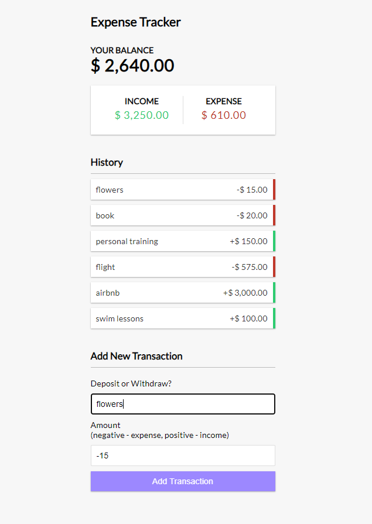

# Expense Tracker

## Description
This is a React projecting showcasing a Expense Tracker featurinng functional components with hooks and the context API. A fun and easy way to track and manage all your expenses and ways of income!

https://expense-tracker-react-kn.netlify.app/




## Usage
```
npm install

# Run on http://localhost:3000
npm start

# Build for prod
npm run build
```

Users will input total amount of money recieved or total amount of money spent. The tracker will display total balance with income and expenses. 

## Credits
Kevin Ng 
Inspired by Brad Traversy


